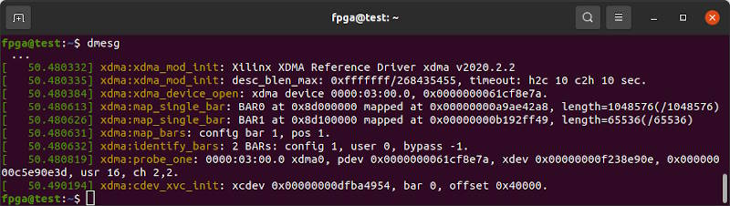

# Innova2 XDMA OpenCAPI

This is a [Vivado 2023.2](https://www.xilinx.com/support/download/index.html/content/xilinx/en/downloadNav/vivado-design-tools/2023-2.html) starter project for the [XCKU15P FPGA](https://www.xilinx.com/products/silicon-devices/fpga/kintex-ultrascale-plus.html) on the [Innova-2 SmartNIC MNV303212A-ADLT](https://www.nvidia.com/en-us/networking/ethernet/innova-2-flex/) that uses the OpenCAPI connector for PCIe and I2C.

The GTY Transceivers connected to the OpenCAPI Connector are in a column that does not contain the Configuration Block so it is impossible for the FPGA to be programmed within the [100ms PCIe power-up time limit](https://pcisig.com/specifications/ecr_ecn_process?speclib=100+ms).


Motherboard boot must be delayed to allow the FPGA to configure itself before PCIe devices are enumerated. This can be accomplished by toggling the POWER button, then pressing and holding the RESET button for a second before releasing it. Or, [connect a capacitor across the reset pins of an ATX motherboard's Front Panel Header](https://github.com/mwrnd/ATX_Boot_Delay).


Currently testing using a [Second Revision OpenCAPI-to-PCIe](https://github.com/mwrnd/OpenCAPI-to-PCIe/releases/tag/v0.2-alpha) adapter. PCIe x8 using the OpenCAPI connector works but requires a high quality cable and uses a [PCIe Lane to Transceiver Channel ordering](compile.tcl#L20) that Vivado complains about.


Refer to [this tutorial](https://github.com/mwrnd/notes/tree/main/Vivado_XDMA_DDR4_Tutorial) for detailed instructions on generating a similar project from scratch.


## Block Design


An offset is used for `AXI_Lite` to simplify [memory-mapping](https://manpages.ubuntu.com/manpages/focal/en/man2/mmap.2.html) the IIC (I2C) Block.


## AXI Addresses

| Block                      | Address (Hex) | Size   |
| -------------------------- |:-------------:| :----: |
| `M_AXI` `BRAM_CTRL_1`      |  0x00000000   |  128K  |
| `M_AXI_LITE` `BRAM_CTRL_0` |  0x40040000   |   64K  |
| `M_AXI_LITE` `GPIO_3`      |  0x40050000   |   64K  |
| `M_AXI_LITE` `IIC_0`       |  0x40060000   |   64K  |


## Program the Design into the XCKU15P Configuration Memory

Refer to the [`innova2_flex_xcku15p_notes`](https://github.com/mwrnd/innova2_flex_xcku15p_notes) project's instructions on [Loading a User Image](https://github.com/mwrnd/innova2_flex_xcku15p_notes/#loading-a-user-image). Binary Memory Configuration Bitstream Files are included in this project's [Releases](https://github.com/mwrnd/innova2_xdma_opencapi/releases).

```
wget https://github.com/mwrnd/innova2_xdma_opencapi/releases/download/v0.1/innova2_xdma_opencapi_bitstream.zip
unzip innova2_xdma_opencapi_bitstream.zip
sha256sum *bin
echo a7d503c692122630295ae6a43a6c2a491b1c6a6b1e5682d6acc68ad1545fe892 should be Checksum of innova2_xdma_opencapi.bit
echo 4b95eea589159197ab7c973038cfea28e6a4fe04385a92a70a736d428d8ab882 should be Checksum of innova2_xdma_opencapi_primary.bin
echo f22c0fefabcf8eb9ced863bf11f3b252b336faa0f2778f6cac1588dd74e08daf should be Checksum of innova2_xdma_opencapi_secondary.bin
```


## Testing the Design

### lspci

After programming the bitstream and rebooting, the design should show up as `Memory controller: Xilinx Corporation Device 9038` under [lspci](https://manpages.ubuntu.com/manpages/jammy/man8/lspci.8.html). It shows up at PCIe Bus Address `01:00` for me but this depends on the PCIe connector you plug your board into.
```
sudo lspci -tv | grep -i "Mellanox\|0000\|Xilinx\|1d"
```


Using a [3M 8ES8-1DF21-0.75](https://www.trustedparts.com/en/search/8ES8-1DF21-0.75) cable and a [Second Revision OpenCAPI-to-PCIe](https://github.com/mwrnd/OpenCAPI-to-PCIe/releases/tag/v0.2-alpha) adapter the PCIe Link Status is usually excellent:


`dmesg | grep -i xdma` provides details on how Xilinx's PCIe XDMA driver has loaded.




### PCIe Link Status versus Cable

Using a [3M 8ES8-1DF21-0.75](https://www.trustedparts.com/en/search/8ES8-1DF21-0.75) cable:


PCIe Link Status is usually excellent:


Using an [SFPCables.com SFF-8654 to SFF-8654 8i](https://www.sfpcables.com/24g-internal-slimsas-sff-8654-to-sff-8654-8i-cable-straight-to-90-degree-left-angle-8x-12-sas-4-0-85-ohm-0-5-1-meter) cable:


PCIe Link Status is downgraded:


I am working on a third revision of the OpenCAPI-to-PCIe adapter to improve signal integrity.


### OpenCAPI I2C over XDMA

The [OpenCAPI-to-PCIe](https://github.com/mwrnd/OpenCAPI-to-PCIe) adapter routes the OpenCAPI I2C signals to an external connector which has the same pin ordering as a [TC74 Temperature Sensor](https://www.microchip.com/en-us/product/tc74). [`innova2_xdma_opencapi_iic_tc74_test.c`](innova2_xdma_opencapi_iic_tc74_test.c) is a simple program to read the temperature and configuration registers of the sensor. Refer to these notes on [AXI IIC (I2C) over XDMA](https://github.com/mwrnd/notes/tree/main/embeddedsw_AXI_IIC_over_XDMA) for more information.


Compile and run the TC74 test program:
```
make
sudo ./innova2_xdma_opencapi_iic_tc74_test
```


After the spraying the sensor with some [Freeze Spray](https://mgchemicals.com/products/electronics-maintenance/freeze-spray-electronics/cooling-spray-electronics/) the temperature drops to below 0C. The data is in [2's-complement format](https://en.wikipedia.org/wiki/Two%27s_complement).


There are only [two I2C registers in the TC74](https://ww1.microchip.com/downloads/aemDocuments/documents/APID/ProductDocuments/DataSheets/21462D.pdf):


## Generating the Design in Vivado

Run the [`source`](https://docs.xilinx.com/r/en-US/ug939-vivado-designing-with-ip-tutorial/Source-the-Tcl-Script?tocId=7Z_1hFhH~LLrqoYsyOuZHw) command from the Vivado **2023.2** [Tcl Console](https://docs.xilinx.com/r/en-US/ug893-vivado-ide/Using-the-Tcl-Console):

```
cd innova2_xdma_opencapi
dir
source innova2_xdma_opencapi.tcl
```


Wait for Synthesis and Implementation runs to finish. The programming files `innova2_xdma_opencapi_primary.bin` and `innova2_xdma_opencapi_secondary.bin` will be generated.


Resources used for the design:


